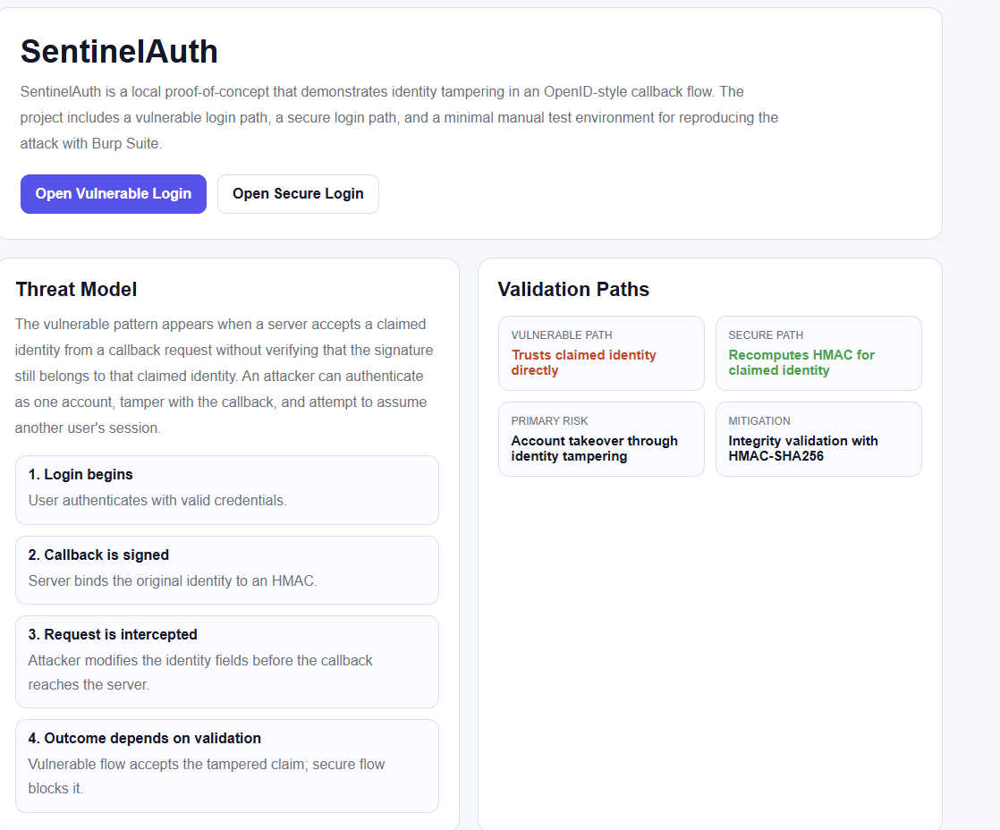
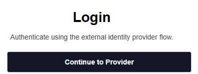
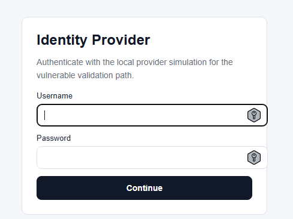
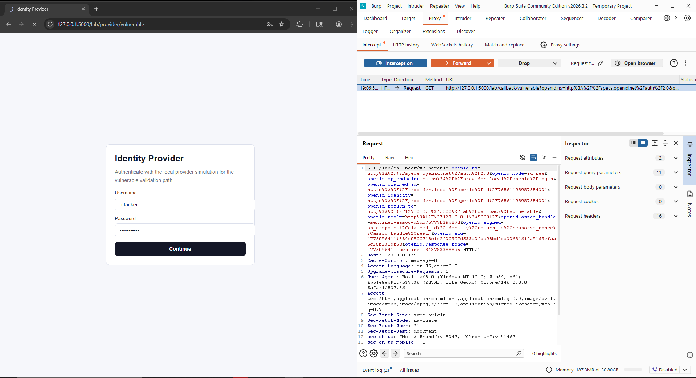
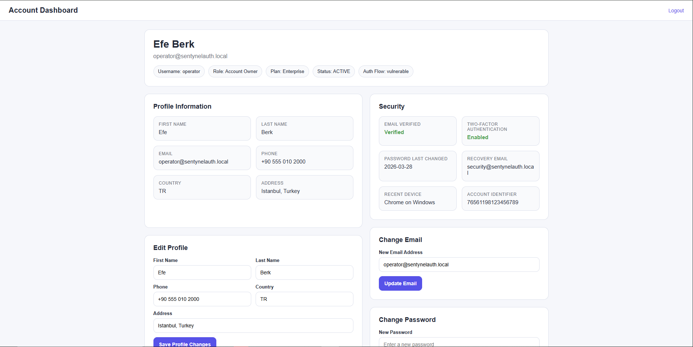
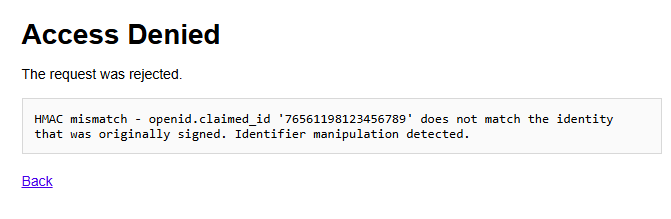

# SentinelAuth

**Identity Assertion Tampering & Mitigation Study**

Identity-bound authentication failures remain one of the most dangerous classes of web security bugs because they break the line between "who actually authenticated" and "who the server believes authenticated." When a backend accepts identity claims from a callback request without re-validating the cryptographic proof attached to that identity, a normal login can turn into an account takeover.

This problem still matters because teams often implement only the happy path of a protocol integration. They validate that a callback looks structurally correct, but fail to confirm that the signed assertion still belongs to the exact identity being claimed. That is the failure mode this project isolates.

SentinelAuth is a controlled local lab built to demonstrate one narrow security concept clearly:

- **identity identifier swap / callback tampering**
- **HMAC-based integrity validation as the mitigation**

## Overview

This repository compares two callback handlers:

- a **vulnerable** callback that trusts the claimed identity directly
- a **secure** callback that behaves more like a real relying party

The project uses a local **OpenID-style provider simulation**. The goal is not to clone any specific third-party service, but to reproduce the provider-to-consumer trust boundary closely enough to demonstrate how an identifier swap succeeds in one path and fails in the other.

Compared with the earlier version of the lab, the current flow is more realistic because it now includes:

- a consumer page that hands the user off to a provider-style login
- an assertion packet with `return_to`, `realm`, `assoc_handle`, `response_nonce`, `signed`, and `sig`
- a provider-side `check_authentication` endpoint
- a secure consumer that actually POSTs the callback packet back to the provider endpoint
- nonce replay protection on the secure consumer flow



## Why the Attack Works

The vulnerable pattern looks like this:

1. A user starts login with account A.
2. The provider signs a callback packet for account A.
3. The attacker intercepts the callback before it reaches the application.
4. The attacker replaces the account identifier in `openid.claimed_id` and `openid.identity` with account B.
5. If the consumer trusts those identity fields without validating the original proof against them, it grants access to account B.

The secure path blocks the same attack by:

1. posting the received assertion back to the provider-side `check_authentication` endpoint
2. requiring that verification to return `is_valid:true`
3. rejecting already-consumed `openid.response_nonce` values

## Local Demo Accounts

These accounts exist only inside the local lab:

- `attacker` / `attacker123`
- `operator` / `operator123`

Mapped identifiers:

- `attacker` -> `76561198987654321`
- `operator` -> `76561198123456789`

## Entry Points

The app exposes two consumer entry points:

- vulnerable login: `http://127.0.0.1:5000/lab/login/vulnerable`
- secure login: `http://127.0.0.1:5000/lab/login/secure`

Each of these routes sends the user into a local provider-style flow and then returns an assertion packet to the application.



## Manual Burp Reproduction

### 1. Start the application

```powershell
cd C:\Users\Efeberk\Desktop\SentinelAuth
python run.py
```

### 2. Open the vulnerable login page

Visit:

`http://127.0.0.1:5000/lab/login/vulnerable`

Click `Continue to Provider`, then authenticate in the provider screen as:

- `username`: `attacker`
- `password`: `attacker123`



### 3. Forward the provider authorization request

The first intercepted request is the simulated provider authorization:

- `POST /lab/provider/authorize/vulnerable`

Do not modify it. Just forward it.

### 4. Intercept and tamper with the callback

Burp will then intercept the important callback:

- `GET /lab/callback/vulnerable?...`

This request contains assertion parameters such as:

- `openid.op_endpoint`
- `openid.claimed_id`
- `openid.identity`
- `openid.return_to`
- `openid.realm`
- `openid.assoc_handle`
- `openid.response_nonce`
- `openid.signed`
- `openid.sig`

In the raw request, find both:

- `openid.claimed_id`
- `openid.identity`

They will initially contain the low-privilege account identifier:

- `76561198987654321`

Replace that value in both places with:

- `76561198123456789`

Do **not** modify:

- `openid.sig`
- `openid.response_nonce`
- `openid.signed`



### 5. Observe the vulnerable outcome

If the vulnerable path is working correctly, the consumer accepts the modified identity and creates a session for the target account.

The browser is then redirected to the target account dashboard.



This is the key proof point:

- login began as `attacker`
- the callback identity was changed to `operator`
- the vulnerable consumer accepted the tampered identity

## Secure Flow

Repeat the same process using:

`http://127.0.0.1:5000/lab/login/secure`

Again:

- log in as `attacker`
- intercept the callback
- change `76561198987654321` to `76561198123456789`
- leave `openid.sig` untouched

This time the request should be rejected because the secure side now behaves more like a real relying party:

1. it sends the received assertion back to `/lab/provider/check-authentication`
2. the provider simulation recomputes and validates the signed fields
3. the consumer only accepts the callback if the provider answers `is_valid:true`
4. the consumer also blocks reused nonces

Expected result:

- the request is rejected
- the browser shows the blocked page with the validation reason



## Optional Replay Demonstration

After a successful secure login, resend the exact same callback request again.

Expected result:

- first request: accepted
- second request: rejected

This shows that the secure consumer is not only checking the signed identity but also tracking whether a callback nonce has already been consumed.

## Why the Vulnerable Flow Fails

The vulnerable callback only checks whether the claimed account exists locally.

It does **not**:

- POST the assertion back to the provider for `check_authentication`
- verify that `openid.identity` still matches `openid.claimed_id`
- enforce the callback origin and field list with the same strictness
- track whether the packet was already replayed

That means an attacker can take a valid callback issued for one user and transform it into a request for another user simply by swapping the identity fields in transit.

## Why the Secure Flow Works

The secure flow validates the signed assertion fields, including:

- `openid.claimed_id`
- `openid.identity`
- `openid.return_to`
- `openid.realm`
- `openid.response_nonce`
- `openid.assoc_handle`

It then sends the same packet back to the provider-style verification endpoint.

If the identifier is changed after signing, the provider recomputes the HMAC and returns `is_valid:false`.

If the same signed packet is replayed, the consumer-side nonce store blocks it.

In short:

- same packet
- modified identity or replayed nonce
- provider or consumer validation fails
- request denied

## Project Structure

```text
SentinelAuth/
|-- core/
|   |-- security.py
|   `-- database.py
|-- api/
|   `-- routes.py
|-- lab/
|   `-- routes.py
|-- tests/
|   `-- test_app.py
|-- ui/
|   `-- templates/
|-- docs/
|   |-- architecture.md
|   |-- manual-walkthrough.md
|   `-- assets/
|-- run.py
|-- Dockerfile
|-- docker-compose.yml
`-- requirements.txt
```

## Automated Tests

Run the test suite with:

```bash
python -m unittest discover -s tests -v
```

The test suite covers:

- home page availability
- provider-style consumer entry page
- neutral `/api/players` schema
- provider `check_authentication` success for original assertions
- secure consumer actually calling provider verification
- vulnerable callback acceptance after tampering
- secure callback rejection after tampering
- secure callback rejection when `claimed_id` and `identity` diverge
- secure callback replay protection
- working profile actions

## Additional Documentation

- [Manual Walkthrough](./docs/manual-walkthrough.md)
- [Architecture Notes](./docs/architecture.md)
- [Threat Model](./docs/threat-model.md)

## Professional Positioning

For GitHub and interviews, the cleanest way to describe this project is:

`A controlled local lab for identity assertion tampering, provider-side verification, and HMAC-based integrity validation.`

That framing keeps the project focused on:

- authentication integrity
- callback trust boundaries
- manual exploit reproduction
- defensive validation logic

## Protocol Note

The current implementation is intentionally service-neutral in the UI, but the underlying lab is inspired by OpenID-style callback verification and identifier-binding failures often seen in third-party sign-in integrations.

## Disclaimer

This repository is for local education and defensive security research only.

It is designed to demonstrate a vulnerability pattern in a controlled environment and should not be used against systems you do not own or explicitly control.
